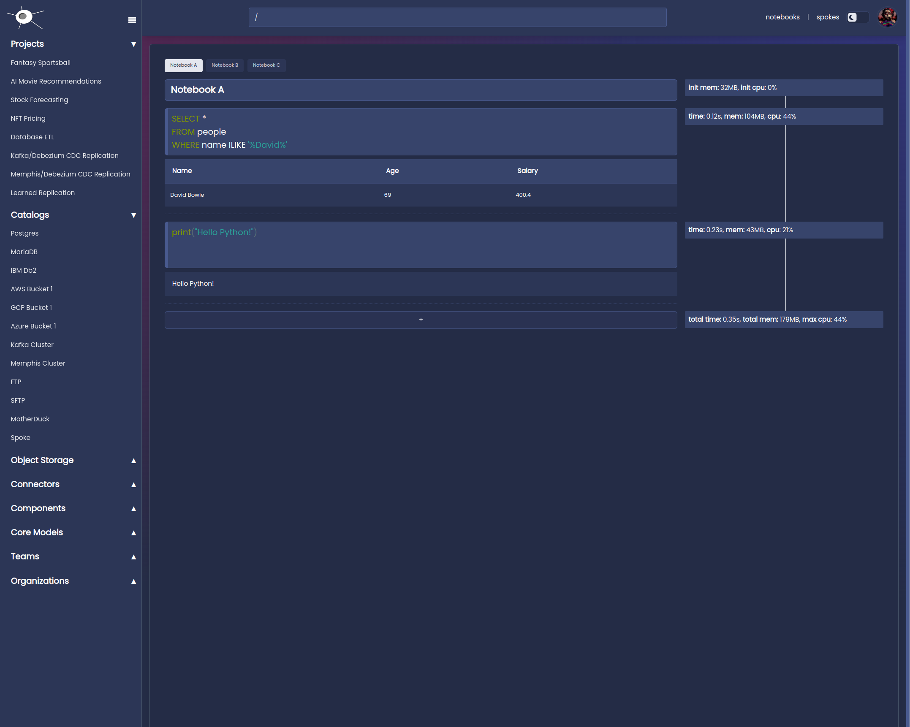

# Spoke

The universal data connector [spoke.sh](https://www.spoke.sh).

A local first development environment that brings a git like experience to data engineering
and reactive applications.



## Development

Start a `nix` dev shell

```shell
nix develop -c $SHELL
```

Install npm package:

```shell
nix run .#ui.install
```

Run the development server:

```shell
nix run .#ui.dev
```

Open [http://localhost:3000](http://localhost:3000) with your browser to see the result.

```shell
nix run .#ui.open
```

Build the `spoke` binary

```shell
nix build .#build-fast --no-sandbox
```

Run the `spoke` binary

```shell
nix run .#build-fast --no-sandbox
```

## Authors

- Alex Kwiatkowski - alex+git@fremantle.io

## License

`spoke` is released under the [MIT license](./LICENSE)
